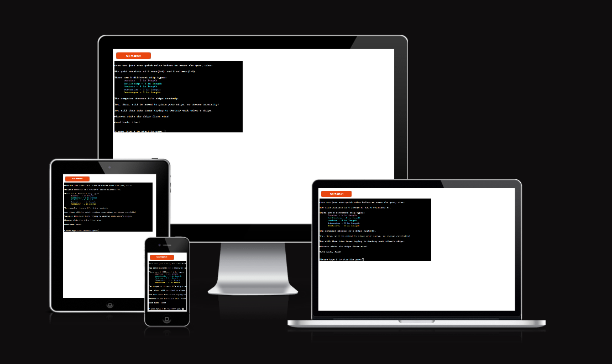
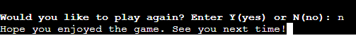

# BATTLESHIP GAME

The Battleship Game is a small computer vs. user game,is designed by using Python and running in the Heroku App. It is based on the famous Battleship Game Board version.
[Click here](https://battleship-game-sina.herokuapp.com/) to see game in Heroku App and to play.

The Battleship Game is a war-themed game for people of all ages. It has been around for many years and also known by a big amount of our populations. It is usually played between two players, the computer and the user in this case. Each of them will have five ships, which the computer will place randomly on its grid. The user will choose where to place their ships on their game board. During the game both opponents are trying to hit and destroy each others ships without knowing their location. The first one to acchieve this goal wins the game and is therefore the reigning hero of the battlefield.

## Contents

* [User Experience](#user-experience)
    * [User Stories](#user-story)
* [Design](#design)
    * [Typography](#typography)
    * [Wireframes](#wireframes)
* [Features](#features)
    * [General features](#general-features)
    * [Future Considerations](#future-considerations)
* [Technologies Used](#technologies-used)
    * [Languages Used](#languages-used)
    * [Frameworks, Libraries & Programs Used](#frameworks-libraries-programs-used)
* [Deployment](#deployment)
* [Testing](#testing)
* [Credits](#credits)
    * [Code Used](#code-used)
    * [Acknowledgements](#acknowledgements)

## [User Experience](#user-experience)

The Battleship is a game sloley designed for pleasuer and fun, a tactic and exciting game for you and old.

### [User Stories](#user-story)

As a first time visitor:
 * I would like to be asked for a username.
 * I would like to receive instructions about the game.
 * I would like to receive interaction from the machine troughout the game.
 * I would like to place my ships and see where they're located on the grid.
 * I would like to see if I hit or missed a computer's ship.
 * I would like be be able to win the game against the computer.
 
 As a returning visitor:
  * I would like to compete with people on the score board.
  * I would like to be able to compete against another user.

## [Design](#design)

### [Typography](#typography)

The game in the Heroku App is mostly running with its standard font. I have imported a special font for the first line of the welcoming message from [Lingojam](https://lingojam.com/CoolTextFonts) and copied special codes to acchieve a bold font or coloured font from a [Stackoverflow Post](https://stackoverflow.com/questions/8924173/how-can-i-print-bold-text-in-python). Some of the text has also the effect to be printed out slow or fast to the terminal which I acchieve by [this guiding post](https://stackoverflow.com/questions/20302331/typing-effect-in-python) from Stackoverflow.

### [Wireframes](#wireframes)

I have used [Balsamiq Wireframes](https://balsamiq.com/) to create the wrieframe and flowchart of the Battleship Game. The main part of the game is made out of two grids, one for the player and the other one for the computer, each containing the ships. 

The flowchart is made to guide me throught the process to acknowlegde each step during the game, designing the various functions needed for the game flow.

This is my initial approach towards my project, which might change throughout the process of the game development.

## [Features](#features)

### [General features](#general-features)

1. #### Welcome message & name input
 * The user is welcomed to the Battleship Game and is asked to enter their name before proceeding. The input must contain letters(lowercase or capital) - can also contain "-" or " " - and hast to be at least two characters in length. This creates an interaction with the player.

 

2. #### Instructions & user input
 * The machine then lists up the instructions to the user, including a quick explanation about columns and rows, what different ship types there are and the goal of the game. Following that the player is asked to input the letter S to be able to start the game. The .upper() is used here in case the user enters a lowercase "s". Entering a different letter prompts the user to enter the valid input.
  
  

3. #### Placing ship & ship placed 
 * Once the game started the user can see their epmty board, with "PLAYER NAME" written above it, and is straight asked to enter the first location of their ship. Firstly they'll choose a position (sideways or downwards), followed by the row (A-H) and finally the column (1-8). If invalid input is entered the user is notified about the mistake and asked to submit a valid answer.
 The ship is then placed in the exact location on the board and made visible to the player. The placing ship progress finishes, once all the five ships are placed.
 The computer at the same time picks their ship placement randomly and places them on a hidden board.

    

4. #### Guessing, Hit & Miss
 * The user will see an empty board, which will contain the guesses of the computer, and then is prompted to enter the coordinates for their guess. The valid has to be valid, otherwise the machine will state an error message for invalid input and to enter the column and row again.

   

 * Above the board the player can see which are their guesses on the board and which are the computer's. Each hit is made visible with a green "X" (for the user hitting the computer's ships) and a red "X" (for the computer hitting the player's ships) in the allocated field. The machine will also type out after each turn if there was a hit(green for player and red for computer) or a miss for either player or computer. If the ships were missed, meaning there is no ship in that desired field, a "|" will be placed, to notify the player of a miss. 
 
    

5. #### End of game
 * Once either the player or the computer sank all the 17 ships of the opponent, the game will end and the winner is announced with a little congratulations message.

 

6. #### Option to play again
 * When the game finishes, the player has the option to choose to play again. If they choose so they are prompted with a message the run the program again and if they don't want to play another round a goodbye message is displayed.

 

### [Future Considerations](#future-considerations)

1. #### Restart game function
 * A future implementation could consist of a function to automatically restart the game if the user desires so. I have tried multiple times to make this function work, but was unable at this stage to acchieve it.

2. #### Leaderboard
 * I would like to introduce a leaderboard with the fastest times a player has won the game.

3. #### Boards next to each other
 * Having the computer and player board next to each other would mean a cleaner run through the game rather then having the screen scrolled down after each step.

## [Technologies Used](#technologies-used)

### [Languages Used](#languages-used)
 
**Python** was the main language used for creating the Battleship game.

### [Frameworks, Libraries & Programs Used](#frameworks-libraries-programs-used)

Other frameworks, not mentioned above yet, include:
* [Gitpod](https://www.gitpod.io/) for writing down the code and creating the game.
* [Heroku](https://www.heroku.com), a Cloud Application Platform, for deploying the game to. 
* [Github](https://github.com/) to save and store the progress and files used on the website.
* [Am I Responsive](https://ui.dev/amiresponsive) was used to create a shot to see responsiveness on different devices.
* [TheSpruceCrafts](https://www.thesprucecrafts.com/the-basic-rules-of-battleship-411069) helped me to apply the rules to the Battleship Game.
* [Python Docs](https://docs.python.org/3/) guided me throughout the whole project and helped me to understand certain parts of it better.

## [Deployment](#deployment)

This project was created by using Gitpod. I used the pre-built template from [Code Institute](https://github.com/Code-Institute-Org/python-essentials-template).
The following commands were used:
* **git add .** - to add all the changes.
* **git commit -m "..."** - to commit all the changes to the local repository.
* **git push** - to push the committed changes to the Github repository.

### **Deployment to HerokuApp**
1. Create a list of requirements, commit and push to GitHub.
2. Create Account with Heroku.
3. On the Heroku Dashboard select "create new app".
4. Give the app a name (it must be unique as each app name can only exist once) and choose your current region.
5. Click "Create App".
6. On the "Settings" Tab scroll to Config Vars.
7. Create a Config Var.
8. In the "KEY" field enter CREDS and for the "VALUE" field copy the creds.json link from your file and click "Add".
9. In the "KEY" field enter PORT and for the "VALUE" field enter 8000 and click "Add".
10. Add Buildpacks.
11. Choose the first one to be python and press "save".
12. Choose the second one to be nodejs and press "save".
13. Move to "Deploy" Tab.
14. Select "GitHub" as Deploment Methond and connect to your GitHub and the repository you want to upload.
15. Choose between automatic/manual deploy option.
16. After app was successfully deployed, click the "View" button to connect to webpage.

### **Cloning**

1. Navigate to [project repository](https://github.com/sinastiller/battleship-game).
2. Click on the button Code next to the Gitpod button.
3. Choose between HTTPS, SSH and Github CLI and copy the link.
4. Open Git Bash.
5. Change the current working directory to the location where you want the cloned directory.

## [Testing](#testing)

Please find the carried out testing on [TESTING.md](TESTING.md).

## [Credits](#credits)

### [Code Used](#code-used)

* [Stackoverflow](https://stackoverflow.com/questions/53446425/creating-a-row-of-numbers-letters-in-my-python-battleship-game) was taking into account when creating the player and computer boards.
* [Code Institue's](https://learn.codeinstitute.net/courses/course-v1:CodeInstitute+PE_PAGPPF+2021_Q2/courseware/b3378fc1159e43e3b70916fdefdfae51/605f34e006594dc4ae19f5e60ec75e2e/) Project Scope video was used as a general guide.
* Various [Stackoverflow Posts](https://stackoverflow.com/search?q=battleship+python&s=e37ddea6-a081-4dc5-ba91-59670214928b) helped me to create and understand the different functions created.
* The [Python Tutorial for Beginners](https://www.youtube.com/watch?v=8124kv-632k&t=5s) from FreeCodeCamp was used to refresh my whole understanding of the programming language Python.
* The [CodeCademy](https://www.youtube.com/watch?v=9Rk4oRkKnCs) Video guided me in utilizing the different lists and functions in Python.
* [Knowledge Mavens'](https://www.youtube.com/watch?v=tF1WRCrd_HQ&t=0s) videos were a very useful guide to create my Battleship Project.

## [Acknowledgements](#acknowledgements)

I would like to thank my amazing Mentor Jubril Akolade for his patience and guidance throughout the Project, the numerous brilliant post in the Slack Community, my gorgeous and cute little cat Maeve for her cuteness overload and especially my partner Lais, for having to put up with my long hours - be it late nights or early mornings - in front of the computer and who always encouraged me not to give up during difficult moments.