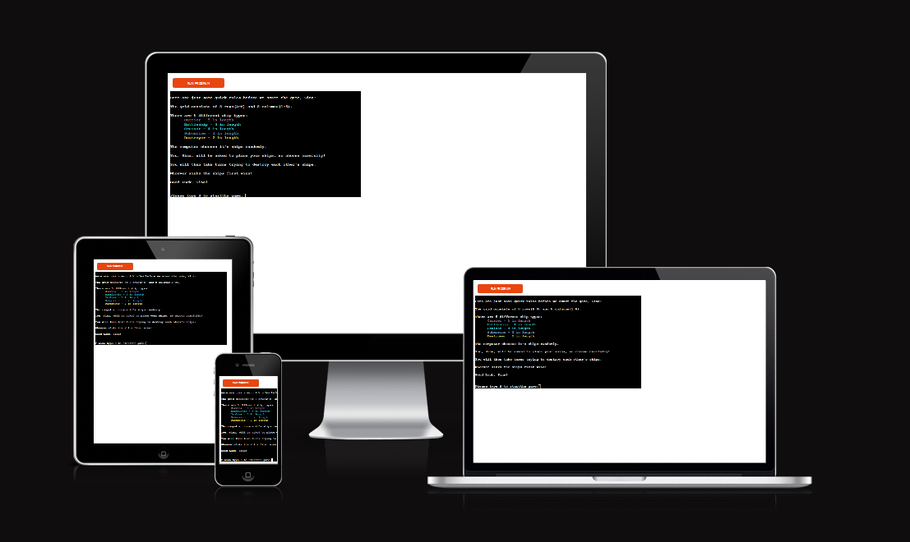
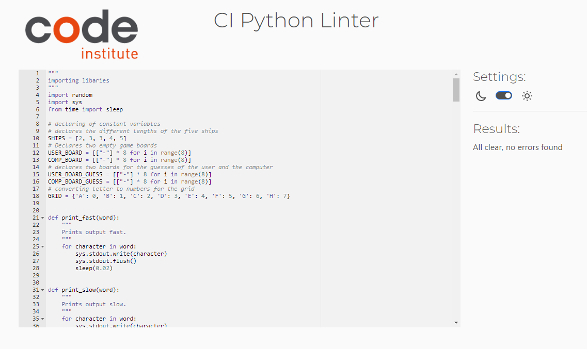
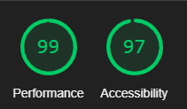

# TESTING FOR BATTLESHIP GAME

## Contents
* [Automated Testing](#automatedtesting)
  * [PEP8 Validator](#pep8validator)
  * [Responsiveness](#responsivness)
  * [Lighthouse](#lighthouse)
* [Manual Testing](#manualtesting)
* [Bugs](#bugs)
  * [Resolved Bugs](#resolvedbugs)
  * [Unresolved Bugs](#unresolvedbugs)

## [Automated Testing](#automatedtesting)

### [PEP8 Validator](#pep8validator)

* To verify that the Python Code is written within the correct structure, I tested it in the Code Institute's . The code was all clear, and no errors were found.

  

### [Responsiveness](#responsivness)

* The app was only tested on a Windows Computer and is fully responsive. I did not test it on mobile devices as the user would not be able to play the game on such a device due to the Heroku App not working on mobile phones.

### [Lighthouse](#lighthouse)

* Lighthouse was used to test the overall performance and accessibility, which both mentioned returned a very high rating.

## [Manual Testing](#manualtesting)

| FEATURE | EXPECTED OUTCOME| ACTION | RESULT |
| -------------              | -------------                                | ------------- | ------------- |
| Print(LENGTH_OF_SHIPS) | Prints List including numbers | print into terminal | prints: [2, 3, 3, 4, 5] |
| Print(USER_BOARD) | Prints List containing eight Lists including eight "-"   | print into terminal | prints: [['-', '-', '-', '-', '-', '-', '-', '-'], ['-', '-', '-', '-', '-', '-', '-', '-'], ['-', '-', '-', '-', '-', '-', '-', '-'], ['-', '-', '-', '-', '-', '-', '-', '-'], ['-', '-', '-', '-', '-', '-', '-', '-'], ['-', '-', '-', '-', '-', '-', '-', '-'], ['-', '-', '-', '-', '-', '-', '-', '-'], ['-', '-', '-', '-', '-', '-', '-', '-']]|
| print(GRID) | Prints dictionary including key(letters): value(numbers) pairs | print to terminal | prints: {'A': 0, 'B': 1, 'C': 2, 'D': 3, 'E': 4, 'F': 5, 'G': 6, 'H': 7}|
| create_board(COMP_BOARD)| Prints computer board containing the rows(with letters) and columns(with numbers) | Print to terminal | Prints empty board to terminal |
| User enters a number or less than two characters | User should be denied and asked to input their name before continuing | for loop checks if entered characters are valid | User receives message "That's not valid, please enter your name." to be able to continue|
| User is asked to enter "S" to start the game | The game should start | User enters "S" | The game commences |
| User is asked to position the ship sideways("S") or downwards("D") | When user enters a different letter besides those two, the question will be repeated until valid input is received | Inputs "F" | Machine prints "Please enter either S or D" and user will have to repeat input |
| User is asked to enter a letter A-H to choose the row | For entering the correct input user will proceed, if wrong input, user is asked to input valid input | User enters A | Machine continues to next step |
| User is asked to enter a number 1-8 to choose column | For entering the correct input user will proceed, if wrong input, user is asked to input valid input | User enters 9 | User is asked "Please enter a valid number from 1-8." to proceed with game |
| Position already contains a ship | User should position their ship differently | User will be notified to rechoose their input | "You have already placed a ship here. Please place in empty field." | User will be notified to rechoose their input | "Please place ship within the grid." |
| Ship not placed within the scope of the grid | User should position their ship differently | 
| User is asked to guess a row to locate computer's ship by entering a letter A-H | By entering a valid letter, user chooses the row where to guess the hit | User enters A | Valid Input |
| User is asked to guess a column to locate computer's ship by entering a number 1- 8 | By entering a valid number, user chooses the column where to guess the hit | User enters 2 | The user will be notified if there was a hit(X) or a miss(/) and it will be entered onto the board |

## [Bugs](#bugs)

### [Resolved Bugs](#resolvedbugs)

The following issues have been solved throughout the process:
* The input_user() was fixed by checking if position_ship is True, to identify any issues with placing ships on the board.
* I fixed the TypeErrors/KeyErrors by adding an else-satement to raise an error, when the input from the user ins't valid they get notified and asked to enter valid input.
* The Computer was able to overlap their ships, so I fixed the ship_cross() for the computer to not be allowed for placing ships in the same fields.
* The hit ships weren't counted due to adding colours to "X". I added the same colour code to the "X" in the hit_ships(board) function to achieve a count of the hits again.
* When the winner was announced, the last hit wasn't visible on the game board. I fixed this issue with the run_game() to achieve the desired outcome.

### [Unresolved Bugs](#unresolvedbugs)
There are two unresolved bugs in my code:
 * I tried to have a function the restarts the game automatically, if the user desires so, but was unable to achieve my desired outcome. I have tried a few different options, but couldn't get anything to work. Therefore, the user is notified to run the program again, if they want to play another round.
 * I was not able to print an output to the user, notifying them, they had already had a hit/miss on a certain field. When this occurs, the user is asked again to choose a column and row, but it is not explained to them why due to input not working.